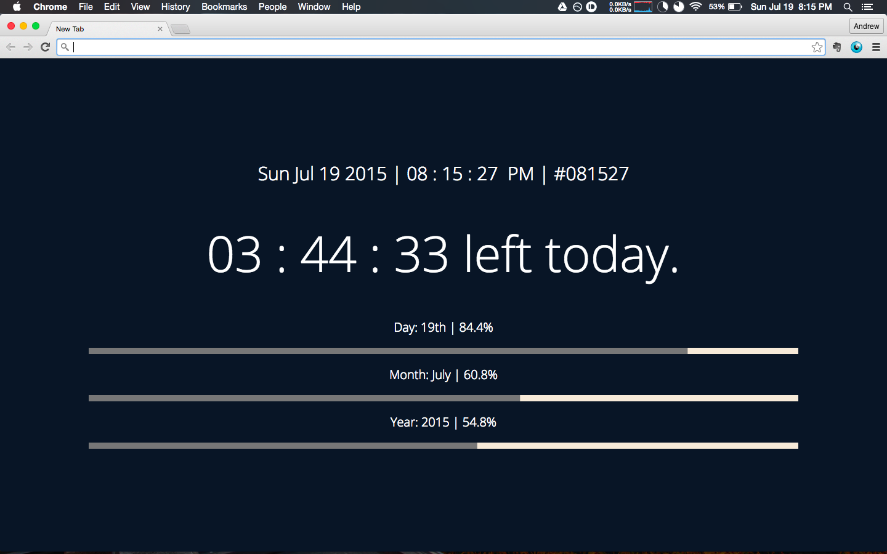

# ColourNewTab
[What Colour Is It?](http://whatcolourisit.scn9a.org/) is a simple website that displays the time as a hex colour (i.e. the hex colour that the digits of the time would be). For example, 2:53:30 in the afternoon becomes 14:53:30 in 24-hour time and then #145330, which is a pleasing dark pine green.

This extension borrows the website source code, adds features like a date and AM/PM distinctions (for us North Americans), and has the necessary modifications (thanks, forbidden embedded Javascript!) to create a Chrome extension that overrides the regular New Tab page and gives you a pleasant (and informative) colour every time you open a new tab.

Update: added a productivity tool to keep focussed, a countdown timer showing how many hours are left in the day and a progress bar to visualize it. Just a quick, fun addition.

Update 2: I liked that last change so much I decided to extend it and make it the focus of the new tab page, with bars also showing how much you've progressed through the month and year. Screenshot below.

Screenshot:

